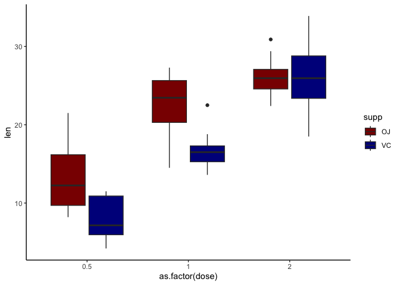
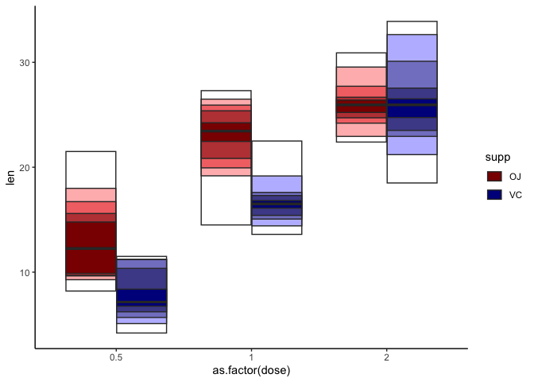
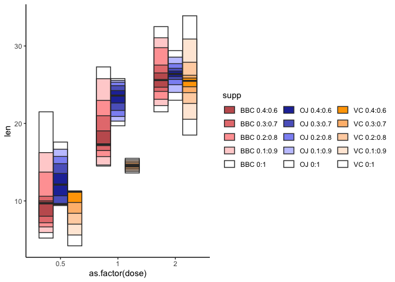

# Quantile plots in ggplot2!

This package implements a `quantile plot` in the ggplot2 framework.

Quantile plots are alternatives to box plots that are useful with
zero-inflated data where the median/quartiles are often times 0 or close
to 0 and hence non-informative.

# Installation

The package can be can be installed via
`devtools::install_github('https://github.com/karchern/ggquantileplot/tree/main')`

# Usage

In it’s most basic form, you can simply exchange the call for
`geom_boxplot` with a call for `geom_quantileplot` You need to supply
the `fill` aesthetic to geom_quantileplot since the color is what
carries the information about the distribution.

``` r
library(ggquantileplot)
library(ggplot2)
baseColors <- c("OJ" = "darkred", "VC" = "darkblue")
```

``` r
ggplot(data = ToothGrowth, aes(x = as.factor(dose), y = len)) +
    geom_boxplot(aes(fill = supp)) +
    scale_fill_manual(values = baseColors) +
    theme_classic() +
    NULL
```

<!-- -->

In quantile plots, darker hues represent the more central part of the
distribution and lighter hues represent the ‘edges’ of the distribution.

In the case of the plot below, the darkest hue corresponds to the 40% to
60% quantile of the distribution, while the darkest and second-darkest
hue together corresponds to the 30%-70% quantile.

``` r
quantilesP <- c(0.5, 0.6, 0.7, 0.8, 0.9, 1.0)
ggplot(data = ToothGrowth, aes(x = as.factor(dose), y = len)) +
    # First entry of quantilesP needs to be 0.5
    geom_quantileplot(aes(fill = supp), quantilesP = quantilesP) +
    scale_fill_manual(values = baseColors) +
    theme_classic() +
    NULL
```

    ## Warning: `data_frame()` was deprecated in tibble 1.1.0.
    ## ℹ Please use `tibble()` instead.
    ## ℹ The deprecated feature was likely used in the ggquantileplot package.
    ##   Please report the issue to the authors.
    ## This warning is displayed once every 8 hours.
    ## Call `lifecycle::last_lifecycle_warnings()` to see where this warning was generated.

    ## Warning in !is.null(data$ynotchlower) && !is.null(data$ynotchupper) &&
    ## !is.na(data$ynotchlower): 'length(x) = 6 > 1' in coercion to 'logical(1)'

    ## Warning in !is.null(data$ynotchlower) && !is.null(data$ynotchupper) &&
    ## !is.na(data$ynotchlower): 'length(x) = 6 > 1' in coercion to 'logical(1)'

    ## Warning in !is.null(data$ynotchlower) && !is.null(data$ynotchupper) &&
    ## !is.na(data$ynotchlower): 'length(x) = 6 > 1' in coercion to 'logical(1)'

    ## Warning in !is.null(data$ynotchlower) && !is.null(data$ynotchupper) &&
    ## !is.na(data$ynotchlower): 'length(x) = 6 > 1' in coercion to 'logical(1)'

    ## Warning in !is.null(data$ynotchlower) && !is.null(data$ynotchupper) &&
    ## !is.na(data$ynotchlower): 'length(x) = 6 > 1' in coercion to 'logical(1)'

    ## Warning in !is.null(data$ynotchlower) && !is.null(data$ynotchupper) &&
    ## !is.na(data$ynotchlower): 'length(x) = 6 > 1' in coercion to 'logical(1)'

<!-- -->

As you can see, by default this implementation of quantile plots has
non-informative legends.

In order to produce informative legends, one needs to use the
`convert_to_quantile_plot_factors` function to add dummy levels to the
factor mapped to the `fill` aesthetic (in this dummy example the `supp`
column).

``` r
# 2 Things to keep in mind
## This adds dummy levels to the supp factor.
## This needs to happen before the base ggplot object is generated
ToothGrowth <- convert_to_quantile_plot_factors(ToothGrowth, 'supp', numExtensions = length(quantilesP) - 1)
```

    ## Warning: Attention: Adding dummy levels to column supp

``` r
quantilePlot <- ggplot(data = ToothGrowth, aes(x = as.factor(dose), y = len)) +
    # First entry of quantilesP needs to be 0.5
    geom_quantileplot(aes(fill = supp), quantilesP = quantilesP) +
    scale_fill_manual(values = baseColors) +
    theme_classic() +
    NULL
quantilePlot <- add_quantileplot_legend(quantilePlot, ToothGrowth, baseColors = baseColors, quantilesP = quantilesP)
```

    ## Scale for fill is already present.
    ## Adding another scale for fill, which will replace the existing scale.

    ## Warning in !is.null(data$ynotchlower) && !is.null(data$ynotchupper) &&
    ## !is.na(data$ynotchlower): 'length(x) = 6 > 1' in coercion to 'logical(1)'

    ## Warning in !is.null(data$ynotchlower) && !is.null(data$ynotchupper) &&
    ## !is.na(data$ynotchlower): 'length(x) = 6 > 1' in coercion to 'logical(1)'

    ## Warning in !is.null(data$ynotchlower) && !is.null(data$ynotchupper) &&
    ## !is.na(data$ynotchlower): 'length(x) = 6 > 1' in coercion to 'logical(1)'

    ## Warning in !is.null(data$ynotchlower) && !is.null(data$ynotchupper) &&
    ## !is.na(data$ynotchlower): 'length(x) = 6 > 1' in coercion to 'logical(1)'

    ## Warning in !is.null(data$ynotchlower) && !is.null(data$ynotchupper) &&
    ## !is.na(data$ynotchlower): 'length(x) = 6 > 1' in coercion to 'logical(1)'

    ## Warning in !is.null(data$ynotchlower) && !is.null(data$ynotchupper) &&
    ## !is.na(data$ynotchlower): 'length(x) = 6 > 1' in coercion to 'logical(1)'

``` r
quantilePlot
```

    ## Warning in !is.null(data$ynotchlower) && !is.null(data$ynotchupper) &&
    ## !is.na(data$ynotchlower): 'length(x) = 6 > 1' in coercion to 'logical(1)'

    ## Warning in !is.null(data$ynotchlower) && !is.null(data$ynotchupper) &&
    ## !is.na(data$ynotchlower): 'length(x) = 6 > 1' in coercion to 'logical(1)'

    ## Warning in !is.null(data$ynotchlower) && !is.null(data$ynotchupper) &&
    ## !is.na(data$ynotchlower): 'length(x) = 6 > 1' in coercion to 'logical(1)'

    ## Warning in !is.null(data$ynotchlower) && !is.null(data$ynotchupper) &&
    ## !is.na(data$ynotchlower): 'length(x) = 6 > 1' in coercion to 'logical(1)'

    ## Warning in !is.null(data$ynotchlower) && !is.null(data$ynotchupper) &&
    ## !is.na(data$ynotchlower): 'length(x) = 6 > 1' in coercion to 'logical(1)'

    ## Warning in !is.null(data$ynotchlower) && !is.null(data$ynotchupper) &&
    ## !is.na(data$ynotchlower): 'length(x) = 6 > 1' in coercion to 'logical(1)'

<!-- -->
