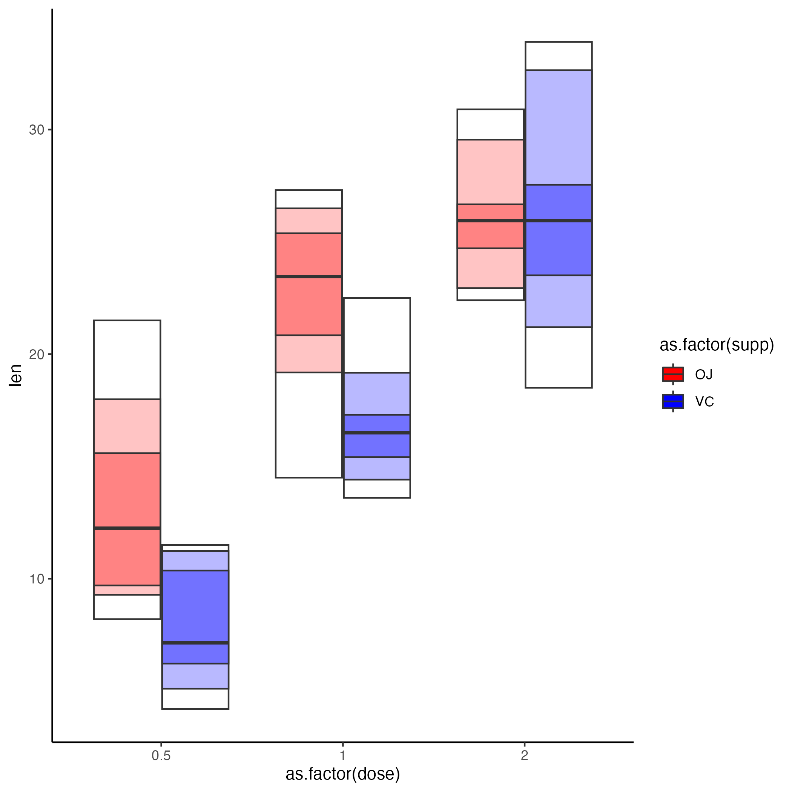

## Summary

This package provides the `geom_quantileplot` function which implements a 'quantile plot' in the `ggplot2` framework. 

Quantile plots are alterntives to box plots that I find useful with zero-inflated data where a the median/IQR range of a boxplot is often times 0 and hence non-informative

## Installation

The package has only a few dependencies and be can be installed via `devtools::install_github('https://github.com/karchern/ggquantileplot/tree/main')`

## Usage 

The function can be used analogously to `geom_boxplot`, with the only exception that uou need to supply the `fill` aesthetic.

```
library(tidyverse)
library(grid)
library(ggplot2)
library(ggquantileplot)

pQuantileplot <- ggplot(data = ToothGrowth, aes(x = as.factor(dose), y = len)) +
    geom_quantileplot(aes(fill = as.factor(supp)), quantilesP = c(0.5, 0.7, 0.9, 1)) +
    scale_fill_manual(values = c("OJ" = "red", "VC" = "blue")) +
    scale_color_manual(values = c("OJ" = "red", "VC" = "blue")) +
    theme_classic()
```

One reads a quantile plot in that the most central, darkest block is the most central quantile (in this case 30%-70%, see argument quantilesP)

