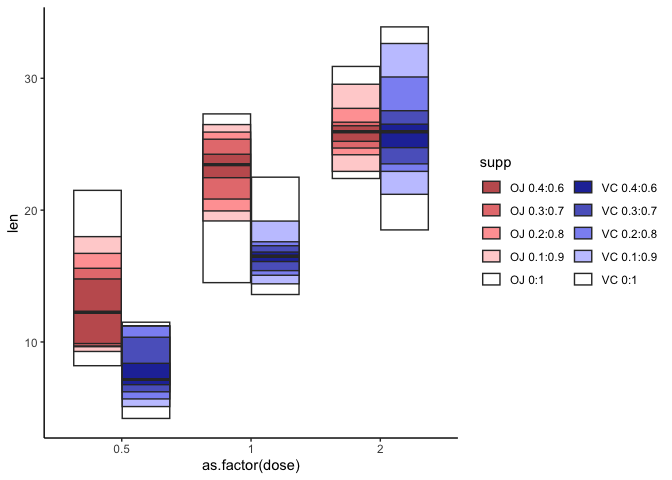

# Quantile plots in ggplot2!

This package implements a `quantile plot` in the ggplot2 framework.

Quantile plots are alternatives to box plots that are useful with
zero-inflated data where the median/quartiles are often times 0 or close
to 0 and hence non-informative.

# Installation

The package can be can be installed via
`devtools::install_github('https://github.com/karchern/ggquantileplot/tree/main')`

# Usage

`geom_quantileplot` is intended to be a drop-in replacement for grouped
`geom_boxplot` using the `fill` aesthetic. You can simply exchange the
call for `geom_boxplot` with a call for
`geom_quantileplot(...) + scale_fill_quantile(...)` (see below).

``` r
library(ggquantileplot)
library(ggplot2)
baseColors <- c("OJ" = "#c45e5e", "VC" = "#2635a6")
```

``` r
ggplot(data = ToothGrowth, aes(x = as.factor(dose), y = len)) +
    geom_boxplot(aes(fill = supp)) +
    scale_fill_manual(values = baseColors) +
    theme_classic() +
    NULL
```

<!-- -->

``` r
quantilesP <- c(0.5, 0.6, 0.7, 0.8, 0.9, 1.0)
quantilePlot <- ggplot(data = ToothGrowth, aes(x = as.factor(dose), y = len)) +
    # First entry of quantilesP needs to be 0.5
    geom_quantileplot(aes(fill = supp), quantilesP = quantilesP) +
    # scale_fill_quantile is crucial here, otherwise color scale is all over the place!
    scale_fill_quantile(baseColors, quantilesP) +
    theme_classic() +
    guides(fill = guide_legend(ncol = 2)) +
    NULL
quantilePlot
```

<!-- -->

It also works with more than 2 groups

``` r
set.seed(3)
quantilesP <- c(0.5, 0.6, 0.7, 0.8, 0.9, 1.0)
baseColors <- c("OJ" = "#c45e5e", "VC" = "#2635a6", "BBC" = "orange")
ToothGrowth$supp <- as.factor(ifelse(runif(nrow(ToothGrowth)) > 0.3, "BBC", as.vector(ToothGrowth$supp)))
quantilePlot <- ggplot(data = ToothGrowth, aes(x = as.factor(dose), y = len)) +
    # First entry of quantilesP needs to be 0.5
    geom_quantileplot(aes(fill = supp), quantilesP = quantilesP) +
    # scale_fill_quantile is crucial here, otherwise color scale is all over the place!
    scale_fill_quantile(baseColors, quantilesP) +
    theme_classic() +
    guides(fill = guide_legend(ncol = length(baseColors))) +
    NULL
quantilePlot
```

<!-- -->

In quantile plots, darker hues represent the more central part of the
distribution and lighter hues represent the ‘edges’ of the distribution.

In the case of the plot below, the darkest hue corresponds to the 40% to
60% quantile of the distribution, while the darkest and second-darkest
hue together corresponds to the 30%-70% quantile.

Please note that the first entry of `quantilesP` needs to be 0.5 and
that `scale_fill_quantile(baseColors, quantilesP)` is crucial.
